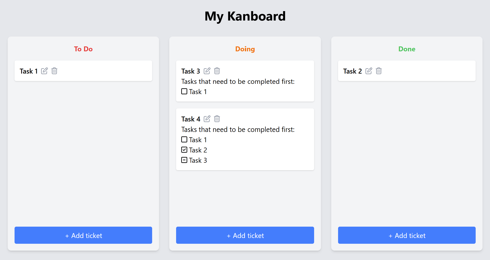
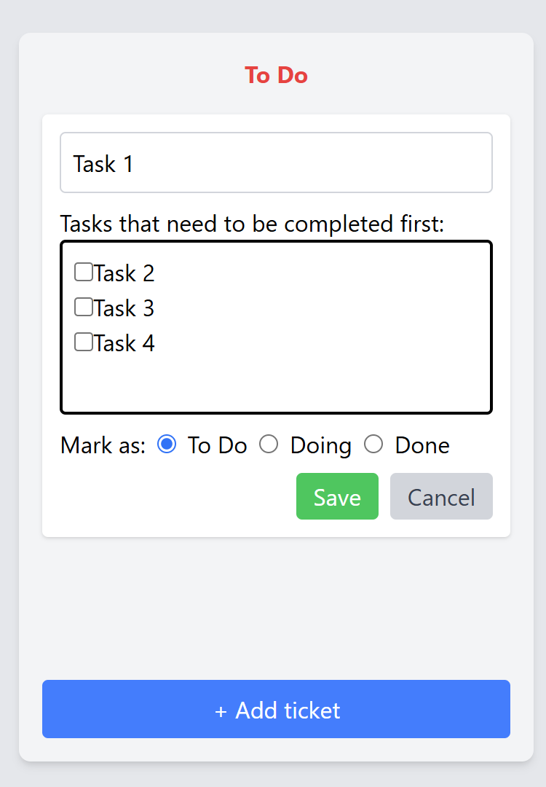
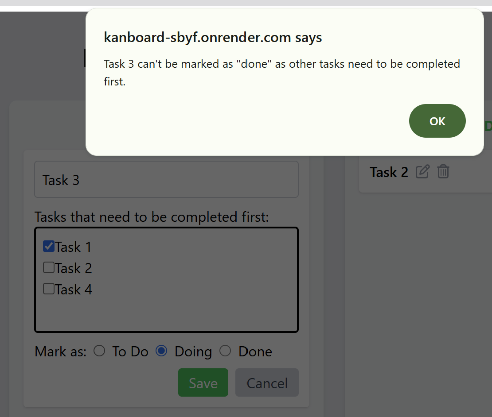
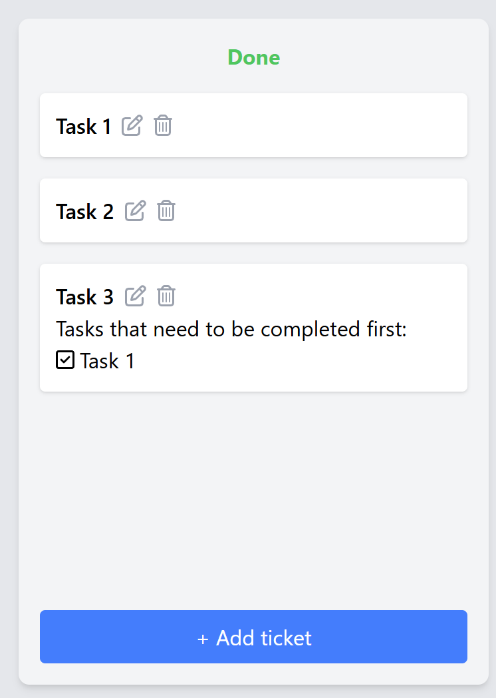
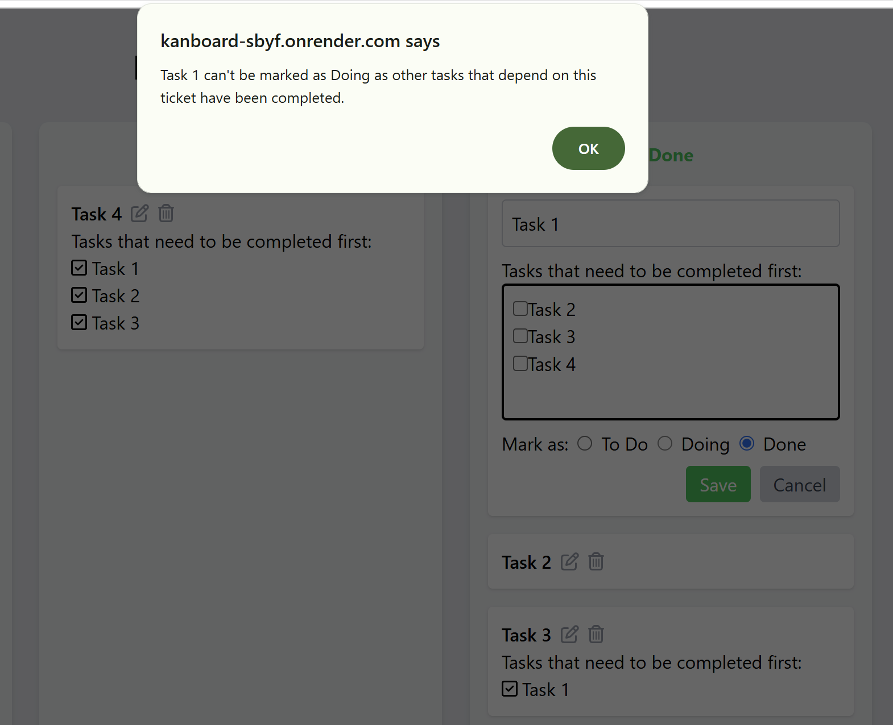

# My Kanboard

An application where tickets can be created, edited and deleted. Tickets can be linked using dependencies.

## Description

1. A ticket can be edited and its title, status and dependencies can be changed.

2. A ticket can not be marked as *done* if all its dependencies are not maked as *done*.

3. The status of a ticket marked as *done* can not be changed if other tickets marked as *done* rely on it.

4. If a ticket is deleted, it is removed from the dependencies of the other tickets.

## How to use

1. Create a .env file in the backend folder.

2. Create a MongoDB collection and fill in the .env file with the necessary information.

MONGODB_URI=

PORT=

3. Run *npm install* then *npm start* in the backend folder.

## Technologies used

- React
- JavaScript
- Node.js
- Express
- MongoDB